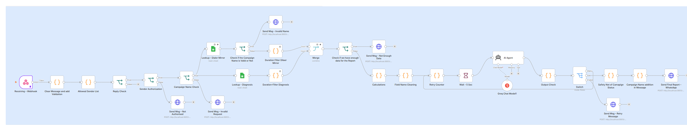

# WhatsApp Diagnostic Assistant

**In one line:** Replaced manual cross-referencing of two tracking sheets with a WhatsApp message — send a campaign name and date range, get a formatted performance report back.

**Problem:** getting campaign performance (conversion, NC ratio, guideline compliance) meant manually cross-referencing two separate tracking sheets per campaign, per date range, every time.

**What I built:** an n8n automation pipeline — a WhatsApp message (via a self-hosted Baileys bridge) is parsed into a campaign name and date range, pulls from both source sheets, aggregates in code, and an LLM narrates the pre-computed numbers into a formatted reply. A deterministic correction layer checks the LLM's output before it sends, since language models can't be trusted with exact figures or status labels.

- Handles 1/7/15/30-day report windows
- Sender-allowlist gating and malformed/unknown-campaign handling
- Built and debugged across multiple sessions, including migrating providers (Gemini → Groq) under free-tier constraints without breaking a pre-existing WhatsApp bridge connection
 

**Result:** manager gets an answer by sending a WhatsApp message instead of opening two sheets and cross-referencing them by hand.

*Tools: n8n, Node.js/Express, Baileys (WhatsApp Web API), Groq API (Llama 3.1), Google Sheets*
